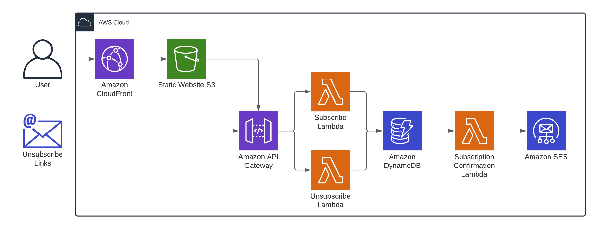

# millhouse.dev Frontend

## Introduction
This repository contains the source code for the Vue web application for my personal website. I use this website to write blog posts about topics that interest me and experiment with different web technologies. You can visit the website [here](https://millhouse.dev).

Some of the features include:
* Fully serverless.
* Static Frontend.
* Basic PWA support.
* Typescript frontend and infrastructure.
* Go backend.

## Diagram

